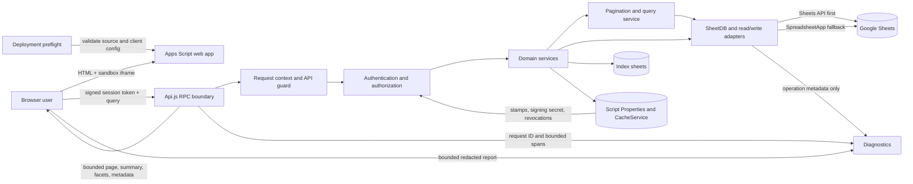

# NBD Portal Architecture

**Status:** Implemented baseline  
**Last updated:** 2026-08-21  
**Runtime:** Google Apps Script web app with Google Sheets persistence

## Purpose

NBD Portal is an internal, multi-portal CRM/worklist application. The current architecture keeps Google Sheets as the system of record while moving authentication, authorization, data normalization, lifecycle rules, filtering, sorting, and pagination behind a server API boundary.

The design optimizes for operational safety and responsive list screens within Apps Script constraints. It does not treat Sheets as a transactional or indexed database.

## Component And Data Flow



## Trust Boundaries

### Browser To Server

The browser is untrusted. User-supplied email addresses, record owners, roles, and module names are not accepted as proof of identity. Every protected RPC passes through `Api.js`, validates the session, checks role/module access, and scopes rows for the authenticated user.

`apiGuard_` creates a per-request context and converts failures to a stable response envelope:

```text
{ success, data | error, code, details?, meta: { requestId, operation, durationMs } }
```

Mutation APIs establish `TRUSTED_WRITE_EMAIL` with `withTrustedWriteUser_`. Domain services read the actor from that execution-scoped context and reject direct write calls without it. Compatibility parameters such as `email` may remain in function signatures, but they do not establish identity.

Administrative maintenance entry points require a container administrator rather than relying on caller-provided values. Private Apps Script helpers use a trailing underscore so browser calls are intended to enter through the API layer only.

### Server To External Systems

Spreadsheet IDs and portal metadata come from client configuration. Authentication signing material and integration credentials belong in Script Properties, not source code or browser HTML. External service responses must not log credentials or sensitive response bodies.

### Sheets As Input

Sheets are administrator-operated but their structure and cell values are still validated. A changed header, duplicate column, malformed date, or formula-like string must not silently alter application behavior.

## Authentication And Sessions

Email/password login supports gradual migration from legacy plain or SHA-256 values to a salted, versioned password representation. Comparison is constant-time where practical, and input length and iteration bounds protect Apps Script execution time. Failed password attempts are throttled per normalized account key in a bounded five-minute CacheService window.

Sessions are HMAC-signed tokens containing normalized email, user ID, portal key, issued-at time, expiry, and a unique token ID. The signing secret is initialized once in Script Properties under a script lock. Token decoding validates format, size, signature, timestamps, portal binding, and claims before loading the current active user and permissions.

Sessions expire after six hours. Logout places the token ID in CacheService for the remaining token lifetime. Legacy cache-backed sessions remain readable during migration. This revocation mechanism is best-effort because CacheService is not a durable security database; rotating `AUTH_SIGNING_SECRET` is the hard invalidation mechanism for all signed sessions.

The browser stores the token in `sessionStorage`. A one-time compatibility path migrates an old `localStorage` token and removes the persistent copy, reducing cross-browser-session exposure.

## Schema-Safe Sheets Access

`ArchitectureCore.js` defines required headers and typed fields for core sheets. Reads validate required and duplicate headers, then normalize known booleans, numbers, and dates into predictable values. Invalid typed values become safe empty/default values rather than leaking inconsistent Sheet representations into domain logic.

Writes neutralize formula-leading strings and control characters before sending values to Sheets. Normal reads and writes do not create missing sheets implicitly. Schema creation or extension happens only through explicit setup paths such as `safeInitHeaders`, which appends missing columns without rewriting existing data.

The read adapter prefers the Google Sheets API and falls back to `SpreadsheetApp`. Both paths use the same row-shaping and schema validation rules. Mutations invalidate the per-execution read cache and synchronize index rows where applicable.

## Lead Lifecycle Model

Business outcome and archival state are separate dimensions:

| Dimension | Values | Source |
|---|---|---|
| Lifecycle outcome | `Open`, `Won`, `Lost`, `Disqualified` | Canonical stage outcome with guarded legacy status fallback |
| Archive state | active or archived | `Is Archived`/archive metadata, with legacy compatibility |

This separation prevents archival from destroying the business result. Lost leads remain Lost until explicitly archived, appear in the dedicated Lost worklist regardless of call count, and can also be inspected through status filtering. Archiving stores `Pre-Archive Status`, archive timestamp, actor, and reason. Restoring clears archive metadata and recovers the prior lifecycle status, deriving it from the stage when legacy data lacks that value.

Archive and restore also reconcile related follow-ups. If a step fails, the service attempts to restore the captured lead and follow-up snapshot and records rollback failures through structured error logging. This is compensation, not an ACID transaction.

## Real Server Pagination

Leads, Follow-ups, and Archive screens call dedicated page endpoints. Search, authorization scoping, filters, tab rules, sorting, summaries, and facets execute on the server. Responses include only the requested items and supporting context:

```text
items, page, pageSize, total, totalPages,
hasPrevious, hasNext, summary, facets
```

Page size is bounded to 100 and out-of-range pages are clamped. Custom fields and related lead/history context are joined only for records needed by the returned page where practical. Sidebar badges come from a compact navigation summary, so bootstrap no longer transfers complete lead and follow-up collections. Topbar search is also server-backed, module-scoped, stale-request protected, and capped to a small result payload.

This is real pagination at the application/RPC boundary: the browser no longer downloads the full worklist and paginates locally. Google Sheets has no indexed `OFFSET/LIMIT` query, so the server must still read, scope, filter, and sort candidate rows in memory for each request. It reduces payload, browser memory, rendering work, and startup time, but does not make storage reads constant-time.

## Caching And Change Stamps

Caching has three distinct roles:

1. Per-execution server read cache avoids repeated Sheet reads during one RPC and is invalidated before mutations.
2. Script Properties data stamps identify collections changed by server writes and support lightweight revalidation.
3. Browser `AppCache` separates `loadedAt` from `serverSyncedAt`, allowing optimistic UI changes without falsely declaring the local copy authoritative.

Bootstrap returns user, configuration, navigation summary, and stamps. List pages fetch their own current server page. After mutations, the active page and navigation summary are refreshed; stamp-based revalidation can still pull server-computed fields. Caches improve responsiveness but are never the system of record.

## Mutation Consistency

Single-row insert, update, and delete primitives use a script lock around row discovery and write operations. Lead creation performs duplicate detection under a lock. Index synchronization and read-cache invalidation follow writes.

Multi-sheet workflows use ordered steps plus compensating cleanup or snapshot restoration. Lead creation removes partially created master/custom-field/follow-up rows on failure; archive/restore restores captured records when a later step fails. NBD transfer serializes duplicate-check and target writes under a bounded lock, reuses an existing source-linked target idempotently, and verifies compensating deletes/restores when a cross-spreadsheet step fails.

Current guarantees are deliberately limited:

- There is no cross-sheet ACID transaction.
- Compensation can itself fail and is therefore logged.
- A global idempotency key is not yet enforced for every create/mutation API; an ambiguous client retry may repeat an operation that lacks its own duplicate guard.
- External integrations are not atomically committed with Sheet mutations.

For higher criticality, introduce mutation IDs with a durable operation ledger and an outbox for external integrations before acknowledging success.

## Startup And Failure Handling

The HTML shell installs early `error` and `unhandledrejection` capture. A bounded startup watchdog replaces an indefinite loading screen with a visible diagnostic state when initialization does not complete. Successful authenticated initialization marks the application ready only after bootstrap state, sidebar, and the initial route are established.

Bootstrap is intentionally compact and has a configuration fallback. Runtime API errors carry stable categories such as `SESSION_EXPIRED`, `FORBIDDEN`, `DATA_SCHEMA_INVALID`, `VALIDATION_ERROR`, and `RATE_LIMITED`, allowing the client to distinguish re-login, operator repair, and retry behavior.

## Deployment Preflight

`deploy.ps1` runs `scripts/deployment-preflight.ps1` for every selected client before copying configuration or invoking `clasp`. Preflight verifies:

- Node.js and `clasp` availability.
- Server JavaScript and inline HTML syntax.
- Each selected `ClientConfig.js` syntax and required values.
- `appsscript.json`, V8 runtime, web-app settings, source layout, and required files.
- HTML include targets and unresolved Git conflict markers.
- Client script IDs, root directories, descriptions, themes, and duplicate Apps Script IDs.

`-All` ignores known unwired placeholder clients, while explicitly selecting one fails before local deployment files are changed. Push and deploy steps check native process exit codes. Preflight improves release safety but does not replace a post-deployment smoke test against each deployed URL.

## Diagnostics Architecture

Diagnostics is a cross-cutting subsystem with a contract-driven release gate in `tests/debug-architecture.contract.test.js`. The contract must pass before the subsystem is considered deployable. If the contract is red, the application-side diagnostics implementation is incomplete even when the rest of the portal tests pass. The operator procedure and report interpretation live in `docs/DEBUGGING.md`.

### Early Browser Capture

`Diagnostics.html` is included in the document head before remote dependencies and application modules. It installs capture-phase resource error handling plus global `error` and `unhandledrejection` handlers while the shell is still loading. This order allows the report to explain a missing dependency or syntax failure that prevents normal application initialization.

The client exposes one bounded interface through `window.PortalDiagnostics`:

```text
record(type, details, level?)
phase(name, state, details?)
rpcStart(operation)
rpcSuccess(handle, details) / rpcFailure(handle, details)
getReport() / formatReport()
```

The startup watchdog delegates to the diagnostics panel rather than replacing the page with ad hoc HTML. The panel renders dynamic content with `textContent` and offers four recovery operations: guarded health check, copy diagnostics, reload, and clear session then reload. Recovery controls remain available when normal UI modules fail to initialize.

### Bounded Client Report

The report is a versioned structured object containing sanitized page/runtime facts, the last startup stage, health state, recent errors/resource failures, and RPC timings. The declared limits are 60,000 report characters, 120 events, and 80 RPC records. Oversized strings, stacks, URLs, arrays, and nested objects are truncated before serialization; oldest records are evicted first.

The diagnostics subsystem may inspect session/local storage only to report a boolean token-presence signal; it never exports the credential value. It strips URL queries/fragments and recursively redacts keys associated with tokens, passwords, authorization, cookies, secrets, API keys, and spreadsheet IDs. Known credential values and spreadsheet identifiers must never appear in a report. Dynamic report text is never passed to `innerHTML`, `insertAdjacentHTML`, or `document.write`.

### RPC Correlation

Every client RPC records the operation and client-observed elapsed time. Every server request enters `apiGuard_`, which creates a request context and returns:

```text
meta.requestId   server-generated correlation ID
meta.operation   guarded operation name
meta.durationMs  time inside the server request context
```

The client retains this metadata for success and application-error envelopes. A transport failure before Apps Script execution has no server request ID; it is correlated by operation and timestamp. Comparing client and server durations separates browser/iframe/network delay from server work.

### Server Logging And Spans

Diagnostic server logs are structured and pass through one recursive sanitizer before reaching `console` or `Logger`. Strings, collections, object depth, stack length, and detail size are bounded. The server retains no more than 40 recent diagnostic spans, and report/snapshot builders sanitize again at the output boundary.

`withDiagnosticSpan_` records stable operation names, outcome, duration, request ID, and minimal metadata. SheetDB primitives emit stable `sheetdb.*` spans such as `sheetdb.read_all`, `sheetdb.write_insert`, `sheetdb.write_update`, `sheetdb.write_delete`, and `sheetdb.write_delete_many`. SheetDB span attributes contain only the normalized sheet label and `read`/`write` mode. They never contain row counts, IDs, cell values, row objects, filters, or mutation payloads.

This is diagnostic telemetry, not an audit ledger. Execution-local state and CacheService may be lost, reordered, or evicted. Business audit requirements continue to use dedicated activity/audit storage.

### Health Endpoints

`apiDiagnosticPing` is guarded by `apiGuard_` but intentionally requires no session, so diagnostics can test Apps Script transport before login. Its payload is public-safe and contains no user, deployment, spreadsheet, integration, or request-input identifiers. It does not hydrate worklists or write to Sheets.

`apiGetDiagnosticSnapshot(token)` is guarded, requires a valid session, and is ADMIN-only. Its sanitized checks cover configuration presence booleans; authenticated/admin context; required Sheet availability, dimensions, and header validity; credential presence booleans; runtime and timezone; recent error fingerprints; and bounded request spans. It must not return identifier values, row values, credentials, user lists, tokens, or passwords, and it must not perform repair writes.

Health checks are layered evidence rather than a single up/down flag. A successful ping proves browser-to-Apps-Script transport and the deployed public-safe endpoint, but not authentication. A successful administrator snapshot adds authenticated configuration and storage evidence. Neither proves that an earlier request was healthy, so incident analysis still follows the failing request ID in Apps Script Executions or Cloud Logging.

### Operational Limits

Observability remains Apps Script-centric. Logs are not a durable queryable application event store, request IDs are not yet propagated through all external integrations, and there are no formal service-level objectives or automated alerts. Cloud Logging can centralize structured entries when the script is linked to a standard Google Cloud project, but bounded in-portal history remains a first-response aid rather than long-term retention.

## Assumptions And Tradeoffs

- The product is an internal operational portal with moderate concurrency and bounded Sheet sizes.
- Google Workspace identity, Apps Script execution, and spreadsheet ownership remain trusted infrastructure.
- Authorization is evaluated on each request against current user configuration, favoring correctness over token-only permission claims.
- Numbered pages are preferred over cursors because Sheets cannot provide a stable indexed cursor without a separate materialized query index.
- Server pagination prioritizes bounded network/UI cost; its server scan cost grows linearly with candidate rows.
- Script locks serialize contested writes across the script and may increase latency during bursts.
- CacheService and Script Properties are coordination aids, not durable queues or transactional storage.
- Compatibility fallbacks reduce migration risk but should be removed after old passwords, sessions, and archive rows are migrated.

## Scale-Out Triggers

Revisit the Sheets architecture when any of these become routine:

- Page queries approach Apps Script execution limits or scan tens of thousands of candidate rows.
- Concurrent writes create lock contention, timeouts, or user-visible retry rates.
- Reporting requires joins, historical aggregation, or ad hoc filters across multiple large sheets.
- Mutation correctness requires durable idempotency, transactions, or exactly-once integration delivery.
- Audit, retention, recovery, or fine-grained access controls exceed spreadsheet capabilities.
- Multiple portals need independent release cadence, APIs, or regional availability.

At that point, move operational entities to a transactional datastore such as PostgreSQL/Cloud SQL or Firestore, expose a versioned backend API, and keep Sheets as an import/export and reporting surface. Use database indexes for filtering and cursor pagination, a durable outbox for integrations, managed identity/session infrastructure, and centralized telemetry. The existing API and domain-service boundaries are intended to make that migration incremental rather than a frontend rewrite.

## Architectural Invariants

Future changes should preserve these rules:

1. Browser input never establishes identity or authorization.
2. Public mutations enter through authenticated API functions and trusted write context.
3. Core Sheet headers are validated before domain logic consumes rows.
4. Lifecycle outcome is not overwritten to represent archival state.
5. List endpoints return bounded pages; full collection hydration is not part of bootstrap.
6. Mutations invalidate stale reads and bump the affected data stamps.
7. Multi-sheet writes either compensate or explicitly record recoverable incomplete work.
8. Deployment cannot begin until client-specific preflight succeeds.
9. Diagnostics loads before optional dependencies and remains usable when startup fails.
10. Diagnostic reports, logs, snapshots, and spans are bounded and sanitized at collection and output boundaries.
11. The public ping remains intentionally unauthenticated and payload-safe; the detailed snapshot remains authenticated and ADMIN-only.
12. Request IDs cross the RPC response boundary and are the canonical browser-to-server correlation key.
